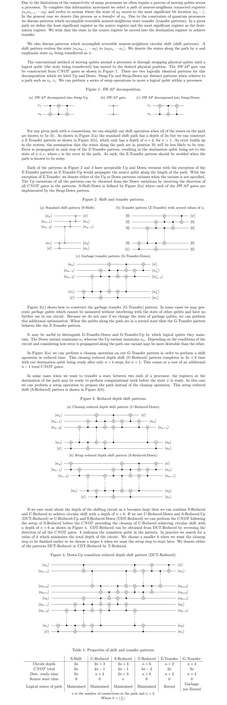

# Transition_Reduced_Circular_Shift

## Table of contents
* [Description](#description)
* [Circuit Identities](#circuit-dentities)
* [Code Implementation](#code-implementation)
* [Acknowledgements](#acknowledgements)

# Description
Circuit identity for faster reversible nearest-neighbour circular shift with CNOT gates.

# Circuit Identities

# Code Implementation

# Acknowledgements
