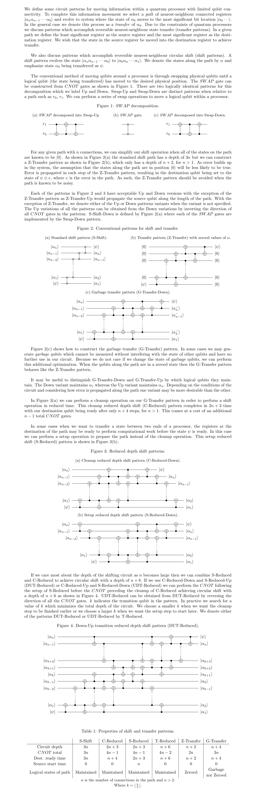

# Transition_Reduced_Circular_Shift
Circuit identity for faster reversible nearest-neighbour circular shift with CNOT gates.

# Circuit Patterns


# Code Implementation
The transfer_patterns.py program includes functions t_reduced, s_reduced,
c_reduced, s_shift, g_transfer, and z_transfer, which implements the T-Reduced,
S-Reduced, C-Reduced, S-Shift, G-Transfer, and Z-Transfer patterns to a qiskit
QuantumCircuit along a given path of QuantumRegister's.

Here is an example implementation of the t_reduced function:
```python
from qiskit import QuantumCircuit, QuantumRegister
from transfer_patterns import t_reduced

qubits = 8
qr = QuantumRegister(qubits)
qc = QuantumCircuit(qr)

t_reduced(qc, [0, 1, 2, 3, 4, 5, 6, 7])
```

# Acknowledgements
This work was completed as part of my undergrad thesis. I would like to thank my
professors Rajesh Pereira and Joe Sawada for co-supervising my thesis and
contributing to this work.

We acknowledge the use of IBM Quantum services for this work. The views
expressed are those of the author, and do not reflect the official policy or
position of IBM or the IBM Quantum team.

# Notes
I don't know if the C-Reduced, S-Reduced, or T-Reduced patterns are novel. If
anyone knows of previous publications of these patterns please create an issue
so that they can be properly credited.
